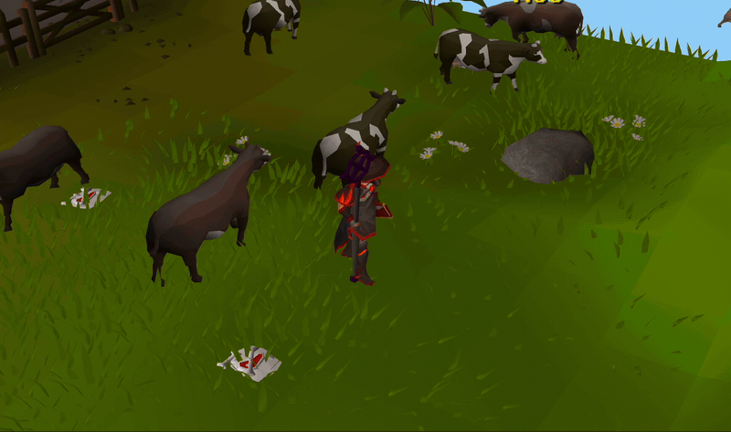

# Ka-Ching!



Every spell you cast and every arrow you break is money leaving your bank. This plugin
makes sure you *feel* it: a gold number floats up over your head with the GE price of
what you just vaporized, and the Grand Exchange coin jingle plays.

Ice Barrage? **-1,187 gp** 🪙 *ka-ching.* Dragon arrow snaps? **-1,502 gp** 🪙 *ka-ching.*
Sanguinesti cast? *ka-ching.* Cannonball? *ka-ching. ka-ching. ka-ching.*

## What counts

- **Spell casts** — the combined GE price of all runes consumed, read from your
  inventory and rune pouch. Runes provided by your staff cost nothing and add nothing.
- **Ranged ammo** — only ammo that is actually *gone*: saved-by-Ava's never counts,
  and ammo that lands on the ground (recoverable) is forgiven. Only breaks ring the till.
- **Charged weapons** — tridents (all variants), Sanguinesti staff, Tumeken's shadow,
  warped sceptre, abyssal tentacle, Scythe of Vitur (all variants), and the
  toxic/blazing blowpipe. Each attack is priced at its per-charge recipe (e.g.
  trident: 1 death + 1 chaos + 5 fires + 10 gp; tentacle: 1/10,000 of an abyssal
  whip per swing, misses included; scythe: 2 bloods + 1/100 vial of blood, only
  when a hit lands).
- **Dwarf multicannon** — every cannonball fired, at regular or granite prices
  (whichever you loaded). Picking the cannon up refunds; decay does not.
- **Food & potions** — every bite and sip, pro-rated: a dose from a Prayer
  potion(3) costs a third of the (3)'s GE price. Gated on the actual Eat/Drink
  click, so dropping or banking food never rings.

## How it works

- Rune counts (inventory + rune pouch varbits) are diffed every game tick; decreases
  that didn't hit the ground and didn't happen at a bank/GE/trade/shop are casts.
  Recharging a trident/sang/shadow/sceptre is detected via its chat dialog and
  excluded — you pay per cast instead, no double counting.
- Equipped weapon/ammo slot decreases enter a 5-tick grace window (projectile flight
  time). If matching ammo spawns on the ground before the window ends, it was a drop;
  otherwise it broke and you hear about it. Only your own drops count as forgiveness —
  another player's identical ammo landing nearby doesn't confuse the accounting.
- Recharges are never billed as casts: recognized charging messages suppress the rune
  tracker, and any bulk rune removal shaped exactly like a weapon's charge recipe
  (5+ charges at once) is treated as a recharge even if the message wasn't recognized.
- Charged weapon attacks are detected per-attack: one animation event per attack for
  4/5-tick weapons, or the animation frame resetting for the blowpipe (whose animation
  outlasts its rapid-fire cooldown).
- Cannon ammo is server-synced (varp 3); each decrease is a shot, ground truth.

## Blowpipe pricing

Blowpipe costs are expected values: ⅔ scale per shot (1-in-3 save) plus darts lost at
(1 − Ava's recovery) — 100% with no device, 60% attractor, 28% accumulator, 20%
assembler. Auto-detect covers Ava's devices, ranging capes, accumulator/assembler max
capes, and Dizana's quivers; anything else (e.g. a Vorkath-upgraded ranging cape)
uses the config override. The plugin learns
your dart type from the right-click **Check** option on the blowpipe — do that once
and it's remembered. If you unload and switch dart types, Check again.

## Config

- Independent toggles: spells, ranged ammo, charged weapons, cannon
- Ava's device override for blowpipe dart math
- Coin jingle on/off and volume
- Minimum gp value to trigger (mute the 15 gp Wind Strikes, keep the barrages)

## Known limitations

- Weapons not in the table are silent.
- Scythe swings that splash 0-0-0 while a thrall deals damage on the same tick are
  billed anyway — hitsplats don't identify their source weapon.
- If another player's identical ammo lands nearby during the grace window, a break
  may be forgiven as a drop. It's a meme plugin, not an accountant.
- Blowpipe/charged-weapon animation IDs can change with game updates; if a weapon
  goes silent after an update, the table needs a refresh.
- Deaths, trades, banking, GE, and shops are filtered out and won't ka-ching.

## Running

```
./test-plugin.sh
```

Builds the shadow JAR and launches RuneLite with the plugin loaded.
